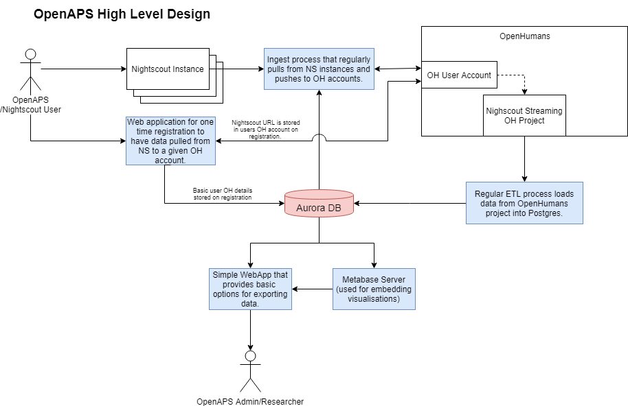

# open-aps-streaming
A set of tools that provide streaming updates of data from NightScout accounts onto OpenHumans, and a data access platform to manage the stored data. It is hosted using AWS.

#### AWS Deployment

The AWS build is defined in 3 cloud formation templates under `/infrastructure/aws`. These templates define:

* The Aurora database used to store all long term data and application state.
* An S3 bucket used to store config files.
* An EC2 instance, along with supporting security group and IAM profile.

The templates should be deployed in the order listed above. The EC2 template also defines a bash script in the user-data field so that on start-up the required dependencies will be installed, the application Docker images will be built, and the service will be ran. The EC2 template assumes that there is a pre-created Elastic IP available to attach to it (creation of this is not templated and will have to be done manually in the AWS console or via the CLI).

All data is stored off host in the database, for this reason the application (and the EC2 instance) can be stopped, removed, and re-created at will without needing to worry about loss of data or important state.

#### Application Structure

The full solution structure is shown below, components highlighted in colour are part of this application and are defined in this repository. The database is highlighted in red, the components highlighted in blue are independent Docker containers that are ran on the EC2 instance. 




These services were built independently, hence why they are ran as separate containers. 

- **The registration site**: This is a single page website that allows users to register their OpenHumans account with the site and to submit their Nightscout URL to OpenHumans. Defined in `registration-site/`.
- **The Nightscout Ingester**: This is a scheduled process that uses the OH data stored in the database, and the Nightscourt URL stored in the corresponding users OH account, to carry out a regular ingest of Nightscout data into OpenHumans. Defined in `nightscout-ingester`.
- **The ETL job**: This is a scheduled process that ingests user data on a regular basis from their OH account and into the application database. Defined in `open-humans-etl`.
- **The Downloader application**: This is a small application designed to enable analysis and simple downloads of large amounts of OpenAPS data. Defined in `data-management-app`.
- **Metabase**: This is an open source data visualisation tool that generates charts using the data stored in the database to be displayed in the downloader application. Config defined in the database (see below).

All containers can be ran so long as they have a live connection to a database initialised with the scripts stored in `open-aps-db/init-scripts` . The only exception to this rule is the metabase server, which stores it's configuration in the database. This configuration can be backed up by taking a dump of the relevant schema (`public`) in the database, but this dump contains sensitive credentials (database access usernames and passwords) so can not be stored on this repository.

#### Application update and deployment

As described above simply deploying the cloud formation templates will result in the application services being started on the EC2 instance. Because of this one option for updating the application is simply to re-deploy the EC2 server cloud formation templates, which will clone a fresh copy of the repository and run this on start-up. Alternatively the server could be SSH'd on to and updated manually by running the following:

```bash
cd /home/ubuntu/open-aps-streaming
./stop-production.sh
git pull origin master
./image-builds.sh
./run-production-application.sh
```

#### DNS and SSL

The routing from the `openaps.org` top level domain to the elastic IP attached to the EC2 instance is managed by the owner of the domain. SSL (HTTPS) access is provided by the reverse-proxy that sits in front of the web components (the registration site and the downloader application). The reverse-proxy used is [Traefik](https://containo.us/traefik/) which allows for easy reverse-proxying of Docker containers ran using Docker-compose. The SSL provision is managed by Traefik using lets-encrypt as the certificate authority.

The Traefik configuration is defined in `reverse-proxy/traefik.toml`, and the container level interaction with Traefik is defined using Docker labels defined in `prod.docker-compose.yml`.